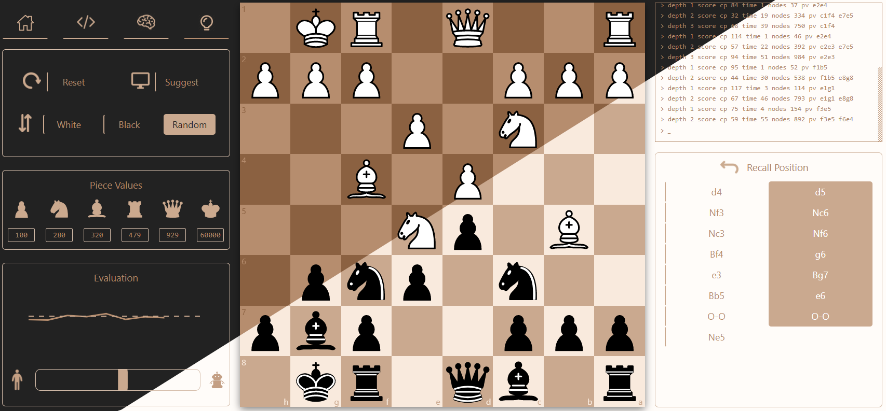
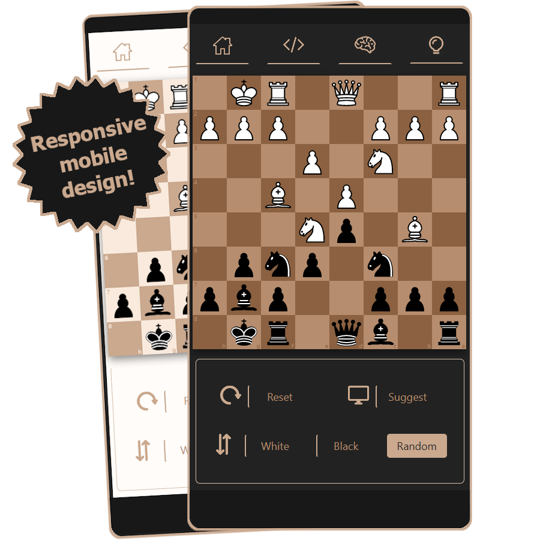

# <a href="https://jeremywiedemeier.com/chess">
jeremywiedemeier.com/chess
</a>

  

# Client side
The primary tools used to build the front-end are React, Typescript, Redux, and Eslint.

Additionally, this project benefited **greatly** from the following resources:

- [Chessboard.jsx](https://github.com/willb335/chessboardjsx) - Supplied the chessboard and provides a convenient api for controlling chess pieces.
- [Chess.js](https://github.com/jhlywa/chess.js/blob/master/README.md) - Encoded the rules of chess/piece movement and manages the game state.
- [Chart.js](https://github.com/chartjs/Chart.js) - Used to build the *Evaluation* line chart.

The static, production web files are compiled by create-react-app's `npm run build` using Webpack + Babel.

 

  

# Server side
The back-end (contained in `./server/`) is a simple Flask app running a stripped down implementation of the [*Sunfish*](https://github.com/thomasahle/sunfish) chess engine. Package management is handled by Pipenv. In the app's only endpoint, */api/sunfish-move*, the position of the chessboard (expressed as an FEN string) and other config options are sent from the client each time a move is played. *Sunfish* performs a short analysis and its best move along with the UCI engine logs are returned. The production app is ran using Gunicorn. For deployment, a Docker image is built and [pushed to Docker Hub](https://hub.docker.com/r/wiedemeier/chess-api) to be pulled into the production environment.

 

# Production environment
This application is deployed on an AWS EC2 Instance. All traffic is ran through an NGINX Docker container equipped with HTTPS. TLS certificates are periodically fetched from Let's Encrypt using a Certbot container (thank you to [this](https://pentacent.medium.com/nginx-and-lets-encrypt-with-docker-in-less-than-5-minutes-b4b8a60d3a71) amazing article). The static files of the production front-end app are served directly from the NGINX web server via a Docker volume. NGINX is also responsible for proxying api calls to the back-end app.

Each of the NGINX server, Flask back-end, and Certbot Docker containers are orchestrated with Docker Compose.
